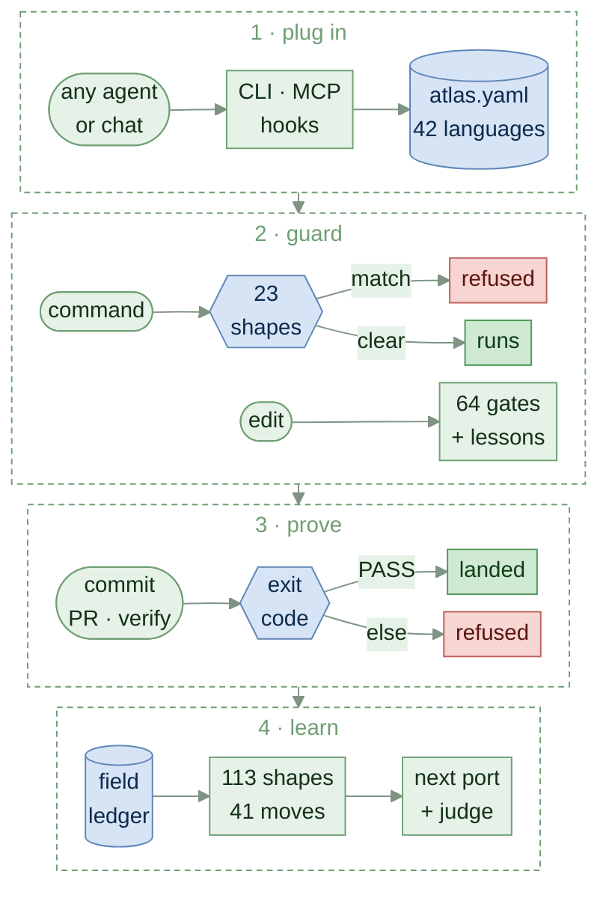

<!-- AGENTS: do not read this page breadth-first. Plug in: `python scripts/atlas.py port <file>`,
     or parse .agent/bootstrap.json — one record back. -->
<!-- mcp-name: io.github.HeartlandIntel/thea -->
<p align="center">
  
</p>

<h1 align="center"><picture>
  <source media="(prefers-color-scheme: dark)" srcset="docs/assets/title-dark.svg">
  
</picture></h1>

<p align="center">
  A machine-readable rulebook for AI coding agents, and the build checks that enforce it.<br>
  <em>AI proposes a change. The file's own toolchain proves it. The build refuses what skipped a check.</em>
</p>

<p align="center">
  <a href="https://github.com/HLIntel/thea-software/actions/workflows/atlas-ci.yml"></a>
  <a href="https://github.com/HLIntel/thea-software/releases/latest"></a>
  <a href="https://scorecard.dev/viewer/?uri=github.com/HLIntel/thea-software"></a>
</p>

Agents start at [llms.txt](llms.txt); chats at [CHAT.md](CHAT.md).

## What it does

Thea tells an AI coding agent which commands prove a change to a file, and fails the build when a
change skipped them. One declaration, [`atlas.yaml`](atlas.yaml), answers **what proves this change
is correct?**

<!-- BEGIN generated: proof-flow (python scripts/atlas.py index --write) -->

<!-- END generated: proof-flow -->

<!-- BEGIN generated: gate-example (python scripts/atlas.py index --write) -->
```console
$ thea gate scripts/doctor.py
1. formatter: ruff format --check scripts/doctor.py
2. compiler_or_typechecker: python3 -c 'import ast,sys; [ast.parse(open(f, encoding="utf-8").read(), f) for f in sys.argv[1:]]' scripts/doctor.py
3. unit_tests: pytest
```
<!-- END generated: gate-example -->

**Not** an app framework or a runtime optimizer.

## Quickstart

<!-- BEGIN generated: install (python scripts/atlas.py index --write) -->
```bash
# no checkout
uv tool install thea-software && thea doctor
# or, editable
git clone --depth 1 --branch v3.53.0 https://github.com/HLIntel/thea-software ~/thea && uv tool install --editable ~/thea && thea doctor
```
<!-- END generated: install -->

```bash
cd ~/thea
thea port scripts/doctor.py   # route, gates, lessons
thea gate scripts/doctor.py   # what proves a change
thea verify                   # exit 0 only if all PASS
```

Read-only MCP: `thea-mcp`. Other repos: [CONSUMING](docs/CONSUMING.md).

<!-- BEGIN generated: port-example (python scripts/atlas.py index --write) -->
```console
$ thea port scripts/doctor.py --line
◉ scripts/doctor.py │ ⠟backend │ python │ ⌂scripts │ ✓3 │ ⚠1 │ → thea gate scripts/doctor.py
$ thea port scripts --line
◎ scripts │ ⠟99 │ ⌂scripts │ → thea brainstorm
$ thea port . --line
○ . │ ⠟126 ⠿4 ⠁3 │ → thea check
```
<!-- END generated: port-example -->

## What it measurably buys

Recorded runs, each naming its instrument: evidence for routing and refusals, not for end-to-end
task success ([limits](docs/CERTIFICATION.md#what-the-numbers-do-not-prove)).

<!-- BEGIN generated: measured-benefits (python scripts/atlas.py index --write) -->
*With Thea*: the model sees what `thea gate` prints. *Blind*: only the language names. Token savings
compare against pasting every language's tool list.

**On Claude** (76 questions per model, `abtest.py` v3.49.0)
- **Opus:** 100% right with Thea, 41% blind; reads 90% fewer tokens.
- **Sonnet:** 100% right with Thea, 39% blind; reads 90% fewer tokens.
- **Haiku:** 100% right with Thea, 39% blind; reads 91% fewer tokens.
- **Claude Code start-up:** loads `CLAUDE.md` and its imports, 1,053 tokens.

**Beyond routing** (blind → with Thea, `taskbench.py` v2.29.0)
- **Name a failure from its symptom:** Opus 93% → 100%; Sonnet 57% → 100%; Haiku 64% → 96%.
- **List the checks a change needs:** Opus 12% → 100%; Sonnet 12% → 100%; Haiku 0% → 100%.
- **Spot a line the build refuses (yes/no, so a coin flip scores 50%):** Opus 60% → 100%; Sonnet 60% → 100%; Haiku 40% → 100%.
- *Not measured:* visual design, open-ended strategy, arithmetic — nothing declares a right answer.

**Across all 11 models tested** (5 providers, 2,409 questions, `abtest.py` v2.27.0 / v2.28.0 / v3.49.0)
- **Right answers:** 99% (95% interval 98–99%) with Thea, 59% (95% interval 55–63%) blind; every model 97–100% with Thea. A random guess scores 2.8%.
- **Tokens:** 89% fewer than pasting every tool list, 51% fewer than blind.

**The repository itself** (recomputed on every build)
- **1,734** tokens read before routing; the other 205 documents (627 KiB) load only when a route names one.
- **378** language × check pairs (42 languages × 9 checks), all answered: 143 with a command, 235 with a declared *no tool*, 0 silently.
- **498** mistake kinds planted in the tests, each refused.
- **17/17** planted breaks refused at commit, in 12 languages; 15 files untested (`enforce.py`, v3.53.0).
- **18/18** agent-to-agent handoffs carry the right checks with Thea (schema alone → with Thea): Opus 0/6 → 6/6; Sonnet 0/6 → 6/6; Haiku 0/6 → 6/6 (`workflowbench.py`).
- **24/24** solo commits clean with or without the hook on these tasks; a planted broken commit is refused.
- **113** failure shapes in the ledger: 197 sightings, 45 recurred; 94 guarded.
- **6** agent controls that block, not warn: narrow_tools, sandbox, budget, approval, effects, audit.
- **10 KiB** install: 1 module, 1 dependency — 1 in total with its own dependencies.
<!-- END generated: measured-benefits -->

## For agents

- **Plug in** with `thea port <file>`, or parse [.agent/bootstrap.json](.agent/bootstrap.json); load only what it names.
- **Read machine output, not this page.** Add `--json` to any command: one record per gate, frozen in
  [tools/atlas-output.schema.json](tools/atlas-output.schema.json).
- **Before a shell command,** `thea shell --json "<cmd>"`: exit 3 means its verdict would be misread.
- **Land** with `python scripts/branchstate.py --land`; ask `thea landed <branch>` before deleting one.
- **Judgments** answer on [rules, teacher or a keyless student](systems/AGENT-HARNESS.md#judgment-rungs).
- **When something breaks,** file it the same turn with the [`thea` skill](skills/thea/SKILL.md).

## Counts, computed

Every number here is generated on each build; `check` fails when one drifts. Sites and dashboards
read the same figures from [.agent/facts.json](.agent/facts.json).

<!-- BEGIN generated: repository-facts (python scripts/atlas.py index --write) -->
- **3.53.0** contract version — `VERSION`, asserted at a declared line in 7 other files
- **42** tool manifests — `languages/<route>/tools.yaml`, validated against `tools/tools.schema.json`
- **401** declared tool entries — distinct entries per manifest, summed; `packprobe.py` classifies every one
- **5** entry kinds — `tools/tools.schema.json` `$defs.entry.x-kinds`
- **8** change classes (verification profiles) — `atlas.yaml/verification_policy/profiles`
- **14** task profiles — `atlas.yaml/task_profiles`
- **98** python files in the harness — `scripts/*.py`, every one held by the `lint` · `format` · `typecheck` gates
<!-- END generated: repository-facts -->

## Find your way

- **Every document:** [docs index](docs/INDEX.md) · [wiki](wiki/README.md)
- **Languages:** [atlas](languages/ATLAS.md) · [routing](wiki/CODE-ROUTING.md) · [verification](docs/VERIFY.md)
- **Agents:** [harness](systems/AGENT-HARNESS.md) · [`.thea`](docs/THEA-LANGUAGE.md) · [runtimes](models/README.md)
- **Why a rule exists:** `thea why` · `thea failures` · [instruments](docs/INSTRUMENTS.md)
- **Security:** [policy](SECURITY.md) · [OpenSSF](docs/OPENSSF.md)

## Project

The version tracks the **contract**, not the content: [docs/VERSIONING.md](docs/VERSIONING.md).
Built by **HLIntel LLC**, public on purpose: **no secret, private path or internal host enters
it** ([ABOUT.md](ABOUT.md)). Contributions pass `thea verify`. [MIT License](LICENSE).
