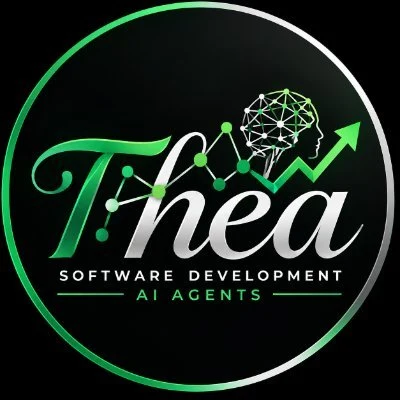

<!-- AGENTS: do not read this page breadth-first. Plug in: `python scripts/atlas.py port <file>`,
     or parse .agent/bootstrap.json — one record back. -->
<p align="center">
  
</p>

<h1 align="center"><picture>
  <source media="(prefers-color-scheme: dark)" srcset="docs/assets/title-dark.svg">
  
</picture></h1>

<p align="center">
  <strong>Thea Software, by Heartland Intel.</strong><br>
  A machine-readable rulebook for AI coding agents, and the build checks that enforce it.<br>
  <em>AI proposes a change. The file's own toolchain proves it. The build refuses what skipped a check.</em>
</p>

<p align="center">
  <a href="https://github.com/HeartlandIntel/thea-software/actions/workflows/atlas-ci.yml"></a>
  <a href="https://scorecard.dev/viewer/?uri=github.com/HeartlandIntel/thea-software"></a>
  <a href="https://github.com/HeartlandIntel/thea-software/actions/workflows/scorecard.yml"></a>
  <a href="LICENSE"></a>
  <a href="https://github.com/HeartlandIntel/thea-software/releases/latest"></a>
</p>

<p align="center">
  <a href="#plug-in">plug in</a> ·
  <a href="#quickstart">quickstart</a> ·
  <a href="#what-it-measurably-buys">results</a> ·
  <a href="#find-your-way">docs</a> ·
  <a href="SECURITY.md">security</a> ·
  <a href="docs/INSTRUMENTS.md">what each instrument proves</a> ·
  <a href="docs/VERSIONING.md">changelog</a> ·
  <a href="LICENSE">MIT</a>
  <br><sub>An AI reading this: agents start at <a href="llms.txt">llms.txt</a>, chats at <a href="CHAT.md">CHAT.md</a>.</sub>
</p>

---

## What it does

AI coding agents fail in a predictable way: they finish a change, run *something*, and report success.
Thea closes that gap. One declaration file, [`atlas.yaml`](atlas.yaml), enforced by programs, sits
between any AI and any repository and answers one question exactly: **what proves this change is correct?**

<!-- BEGIN generated: glance (python scripts/atlas.py index --write) -->
**36** languages · **53** extensions · **64** gates · **7** runtimes · **79** failure shapes · **25** success moves · **46** invariants · **70** instruments · **241** agreement edges · **1** dependency
<!-- END generated: glance -->

Point it at a file. Thea resolves the file to its [language pack](languages/ATLAS.md), the change to
the [gates](docs/VERIFY.md) it must pass, and each gate to the check-only command that language's own
toolchain provides. Where a toolchain has no such tool it says so and names who covers the gap. It
never guesses, and it refuses ambiguous input.

<!-- BEGIN generated: gate-example (python scripts/atlas.py index --write) -->
```console
$ thea gate scripts/doctor.py
1. formatter: ruff format --check scripts/doctor.py
2. compiler_or_typechecker: python3 -c 'import ast,sys; [ast.parse(open(f, encoding="utf-8").read(), f) for f in sys.argv[1:]]' scripts/doctor.py
3. unit_tests: pytest
```
<!-- END generated: gate-example -->

It holds that line at every point a change passes:

- **At commit.** A git hook refuses a file its own toolchain rejects ([consuming Thea](docs/CONSUMING.md)).
- **On the pull request.** CI runs the same gate set; a document, count or version that drifted fails.
- **In the agent's report.** `thea verify` returns PASS, FAIL or NOT RUN per gate from its exit code.

**Not** an app framework, a runtime optimizer or a sandbox. It generates a sandbox from a task
contract ([agent harness](systems/AGENT-HARNESS.md)); running it is the host's job.

## Plug in

`thea port` is the socket. One call returns everything Thea knows about a target: route, stack tier,
place, gates with their commands, the failure ledger's lessons with the move that replaces each, the
documents to read, and the next commands. Three **lenses** set the distance: `narrow` (a file),
`code` (a place), `codebase` (the tree, split by tier from frontend to database). Five **frames** set
the audience: `codebase`, `chat`, `tree`, `model`, `agent`.

<!-- BEGIN generated: port-example (python scripts/atlas.py index --write) -->
```console
$ thea port scripts/doctor.py --line
◉ scripts/doctor.py │ ⠟backend │ python │ ⌂scripts │ ✓3 │ → thea gate
$ thea port scripts --line
◎ scripts │ ⠟70 │ ⌂scripts │ → thea brainstorm
$ thea port . --line
○ . │ ⠟96 ⠿4 ⠁3 │ → thea check
```
<!-- END generated: port-example -->

The line is fixed glyphs in a fixed order: `◉◎○` lens · `⠁⠃⠇⠏⠟⠿` tier, whose dots fill as the layer
deepens · `⌂` place · `✓` gates · `⚠` lessons · `→` next step. Coloured on a terminal, plain
under `NO_COLOR` or a pipe. Layers come from `atlas.yaml/stack_tiers`, and a repository's own
`.atlas.yaml` replaces them. Every runtime's entry file names the port, and every command sits on a
lens's menu; `check` refuses either gap.

<!-- BEGIN generated: settings (python scripts/atlas.py index --write) -->
| where you use it | what Thea does there |
|---|---|
| A chat with no tools | name the format, typecheck and test commands for any file they name (the route table below, then that pack's tools.yaml), review a pasted diff against the gates, and turn a goal into the checklist of gates its change class requires |
| A chat that keeps instructions | paste the Install block once, and every later chat starts routed, labels its claims and files breaks with the report verb |
| An agent with a shell | clone a release tag and run `python scripts/atlas.py gate <file>` — the numbered commands that prove a change to that file — then `python scripts/enforce.py install` in the repository being changed, so a commit that fails its own toolchain's check is refused |
| A repository's CI | call the reusable workflow, and drift fails the pull request |
| A retrieval or RAG pipeline | run the retrieval_change gates — chunk boundaries, a freshness stamp, hybrid recall and citation checks — so an answer is grounded in what was actually retrieved |
| An autonomous agent run | write a task contract, and `python scripts/sandboxgen.py docker <contract>` prints the host sandbox it needs — no network, read-only root, only the worktree writable |
| A chat or agent with memory | save verdicts by id (a gate, a change class, a ledger entry) with their contract version, never a paraphrase: an id re-checks against the tree, a summary drifts |
<!-- END generated: settings -->

## Quickstart

```bash
python scripts/atlas.py port   scripts/doctor.py    # plug in: route, tier, gates, lessons, next steps
python scripts/atlas.py gate   scripts/doctor.py    # the commands that prove a change to this file
python scripts/atlas.py plan   scripts/doctor.py --task implementation --change source_change
python scripts/verify.py                            # every gate, one verdict each; exit 0 only if all PASS
```

Installed, these answer as **`thea <command>`** (`thea commands` lists all; `thea <command> --help`
is the cheapest manual) and **`thea-mcp`** serves them read-only. `--json` records are frozen in
[tools/atlas-output.schema.json](tools/atlas-output.schema.json). From another repository:
[docs/CONSUMING.md](docs/CONSUMING.md).

## What it measurably buys

Recorded runs on Thea's own suites, each naming its instrument and version: evidence for routing,
checks and refusals, not proof of end-to-end task success ([limits](docs/CERTIFICATION.md#what-the-numbers-do-not-prove)).

<!-- BEGIN generated: measured-benefits (python scripts/atlas.py index --write) -->
*With Thea*: the model is shown what `thea gate` prints for the file. *Blind*: it gets only the list
of language names. Token savings are against the usual alternative: pasting in every language's tool list.

**On Claude** (39 questions per model, `abtest.py` v2.28.0)
- **Opus:** 100% right with Thea, 41% blind; reads 91% fewer tokens.
- **Sonnet:** 95% right with Thea, 41% blind; reads 91% fewer tokens.
- **Haiku:** 97% right with Thea, 41% blind; reads 91% fewer tokens.
- **Claude Code start-up:** reads only `CLAUDE.md`, 67 tokens.

**Beyond routing** (blind → with Thea, `taskbench.py` v2.29.0)
- **Name a failure from its symptom:** Opus 93% → 100%; Sonnet 57% → 100%; Haiku 64% → 96%.
- **List the checks a change needs:** Opus 12% → 100%; Sonnet 12% → 100%; Haiku 0% → 100%.
- **Spot a line the build refuses (yes/no, so a coin flip scores 50%):** Opus 60% → 100%; Sonnet 60% → 100%; Haiku 40% → 100%.
- *Not measured:* visual design, open-ended strategy, arithmetic — nothing declares a right answer.

**Across all 11 models tested** (5 providers, 2,076 questions, `abtest.py` v2.27.0 / v2.28.0)
- **Right answers:** 98% with Thea, 63% blind; every model 95–100% with Thea. A random guess scores 2.8%.
- **Tokens:** reads 89% fewer than pasting every tool list, and 51% fewer than asking blind.

**The repository itself** (recomputed on every build)
- **Before routing:** an agent reads 1,735 tokens. The other 191 documents (589 KiB) load only when a route names one.
- **Coverage:** all 324 language × check pairs answer — 133 with a command, 191 with a declared *no tool*, 0 silently.
- **Mistakes caught:** 350 kinds are planted in the tests, and each must be refused.
- **Enforced at commit:** refused 17 of 17 planted breaks in 12 languages; 11 files untested here (`enforce.py`, v3.6.0).
- **Agent-to-agent handoffs with the right checks** (schema alone → with Thea): Opus 0/6 → 6/6; Sonnet 0/6 → 6/6; Haiku 0/6 → 6/6 (`workflowbench.py`).
- **Solo commits:** 24/24 clean with or without the hook on these tasks; a planted broken commit is refused.
- **Agent controls that block, not warn:** narrow_tools, sandbox, budget, approval, effects, audit.
- **Install:** 5 KiB, 1 modules, 1 dependency — 1 in total with its own dependencies.
<!-- END generated: measured-benefits -->

## How it works

| part | what it gives you | where |
|---|---|---|
| **Port** | one record per file, place or tree, at three lenses and five frames | `thea port` · [runtimes](models/README.md) |
| **Routing** | the language pack for any file, and *which precedence rule* chose it | `thea route` · [routing](wiki/CODE-ROUTING.md) |
| **Gates** | the change class picks the checks; each resolves to a command or a declared *no tool* | `thea gate` · [verification](docs/VERIFY.md) |
| **Ledgers** | failures with their tell and refusal; successes with the move that replaced them | `thea failures` · `thea successes` |
| **Language packs** | compiler, formatter, tests, debugger, profiler, security tool, loaded only when routed | [languages](languages/ATLAS.md) · [pack contract](languages/PACK-SPEC.md) |
| **Agent harness** | a task contract whose controls refuse rather than warn, and a hash-chained audit | [harness](systems/AGENT-HARNESS.md) · [`.thea`](docs/THEA-LANGUAGE.md) |
| **Enforcement** | a pre-commit hook, CI on every pull request, a landing that cannot strand a branch | `enforce.py` · `thea landed` |
| **Markdown** | living notes capped and reachable, records append-only | `thea md` |
| **Brainstorm** | three options and a baseline, scored, pre-mortemed; a dominated choice is refused | `thea brainstorm` |

The rules it will not bend, each with the defect it was measured against: `thea why` · [AGENTS.md](AGENTS.md).

## For agents

Plug in with `thea port <file>`, or parse [.agent/bootstrap.json](.agent/bootstrap.json); load only
what the answer names. Reading this tree breadth-first is `atlas.yaml/context_policy/forbidden_default`.

- **Before a shell command,** `thea shell --json "<cmd>"`: exit 3 means its verdict would be misread.
- **Land** with `python scripts/branchstate.py --land`, and ask `thea landed <branch>` before closing or deleting one.
- **When something breaks,** file it the same turn with the [`thea` skill](skills/thea/SKILL.md).

## Counts, computed

Every number on this page is generated from the tree on each build, and `check` fails when one drifts.

<!-- BEGIN generated: repository-facts (python scripts/atlas.py index --write) -->
- **contract version:** 3.47.0 — `VERSION`, asserted at a declared line in 6 other files
- **tool manifests:** 36 — `languages/<route>/tools.yaml`, validated against `tools/tools.schema.json`
- **declared tool entries:** 372 — distinct entries per manifest, summed; `packprobe.py` classifies every one
- **entry kinds:** 5 — `tools/tools.schema.json` `$defs.entry.x-kinds`
- **verification gate classes:** 8 — `atlas.yaml/verification_policy/profiles`
- **task profiles:** 14 — `atlas.yaml/task_profiles`
- **python files in the harness:** 69 — `scripts/*.py`, all linted by ruff
<!-- END generated: repository-facts -->

What each instrument proves and does not: [docs/INSTRUMENTS.md](docs/INSTRUMENTS.md) · invariants: `thea invariants`.

## Find your way

| to… | go to |
|---|---|
| plug an agent or a chat in | `thea port --frame agent` · [runtimes](models/README.md) · [CHAT.md](CHAT.md) · [llms.txt](llms.txt) |
| route a file or run a pack's tool | `thea route` · `thea do` · [manifest contract](languages/PACK-TOOLS-SPEC.md) |
| follow a named process end to end | `thea process` · [verification](docs/VERIFY.md) |
| pick or add a language | [languages](languages/ATLAS.md) · [packs](languages/README.md) · `thea pick` · `thea learn` |
| combine languages | [polyglot engineering](systems/POLYGLOT-ENGINEERING.md) |
| run an agent under real controls | [agent-task.schema.json](tools/agent-task.schema.json) · [agent harness](systems/AGENT-HARNESS.md) |
| run a language in production | [language operations](wiki/LANGUAGE-OPERATIONS.md) · [systems](systems/README.md) |
| choose tools, a model or a runtime | [tool orchestration](wiki/TOOL-ORCHESTRATION.md) · [MCP matrix](integrations/MCP-LANGUAGE-MATRIX.md) |
| land work or clean a worktree | [branch and worktree model](wiki/BRANCH-WORKTREES.md) · `thea landed` |
| configure or audit GitHub | [GitHub backend](docs/GITHUB-BACKEND.md) · [finalization](docs/GITHUB-FINALIZATION.md) · `ghaudit.py` |
| add a dependency well | [package catalog](docs/PACKAGE-CATALOG.md) · [dependencies](docs/DEPENDENCIES.md) |
| learn why a rule exists | [engineering concepts](docs/ENGINEERING-CONCEPTS.md) · [research](research/ENGINEERING-RESEARCH.md) |
| report a vulnerability | [security policy](SECURITY.md) · [OpenSSF](docs/OPENSSF.md) |
| everything else | [docs index](docs/INDEX.md) · [wiki](wiki/README.md) · [codespace](.devcontainer/README.md) |

## Project

The version tracks the **contract** (what is enforced, routed or required), not the content; one
line per version is the changelog, and every release is tagged: [docs/VERSIONING.md](docs/VERSIONING.md).

Built by **Heartland Intel** and public on purpose: an atlas that needs a token to read cannot route
an agent that has none. The price is one absolute rule: **no secret, credential, private-project path
or internal hostname enters this repository**, in any file or in history. [ABOUT.md](ABOUT.md) covers
what lives here and what stays private.

Contributions follow the same contract as any change: `thea verify` must pass, and the pull request
template asks what would prove the goal met. Licensed under the [MIT License](LICENSE).
