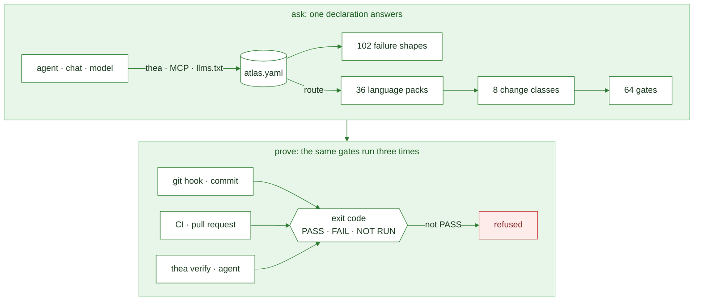

<!-- AGENTS: do not read this page breadth-first. Plug in: `python scripts/atlas.py port <file>`,
     or parse .agent/bootstrap.json — one record back. -->
<p align="center">
  
</p>

<h1 align="center">Thea Software</h1>

<p align="center">
  A machine-readable rulebook for AI coding agents, and the build checks that enforce it.<br>
  <em>AI proposes a change. The file's own toolchain proves it. The build refuses what skipped a check.</em>
</p>

<p align="center">
  <a href="https://github.com/Thea-Software/thea-software/actions/workflows/atlas-ci.yml"></a>
  <a href="https://github.com/Thea-Software/thea-software/releases/latest"></a>
  <a href="LICENSE"></a>
</p>

An AI reading this: agents start at [llms.txt](llms.txt), chats at [CHAT.md](CHAT.md).

## What it does

Thea tells an AI coding agent which commands prove a change to a file, and fails the build when a
change skipped them. One declaration, [`atlas.yaml`](atlas.yaml), answers **what proves this change
is correct?** It never guesses, and refuses ambiguous input.

<!-- BEGIN generated: proof-flow (python scripts/atlas.py index --write) -->

<!-- END generated: proof-flow -->

<!-- BEGIN generated: gate-example (python scripts/atlas.py index --write) -->
```console
$ thea gate scripts/doctor.py
1. formatter: ruff format --check scripts/doctor.py
2. compiler_or_typechecker: python3 -c 'import ast,sys; [ast.parse(open(f, encoding="utf-8").read(), f) for f in sys.argv[1:]]' scripts/doctor.py
3. unit_tests: pytest
```
<!-- END generated: gate-example -->

It holds that line at every point a change passes:

- **At commit.** A git hook refuses a file its own toolchain rejects ([consuming Thea](docs/CONSUMING.md)).
- **On the pull request.** CI runs the same gate set; a document, count or version that drifted fails.
- **In the agent's report.** `thea verify` returns PASS, FAIL or NOT RUN per gate from its exit code.

**Not** an app framework, a runtime optimizer or a sandbox.

## Quickstart

```bash
python scripts/atlas.py port   scripts/doctor.py    # plug in: route, tier, gates, lessons, next steps
python scripts/atlas.py gate   scripts/doctor.py    # the commands that prove a change to this file
python scripts/verify.py                            # every gate, one verdict each; exit 0 only if all PASS
```

Installed, these answer as **`thea <command>`** (`thea commands` lists all) and **`thea-mcp`** serves
them read-only. From another repository: [docs/CONSUMING.md](docs/CONSUMING.md). Every setting, from a
chat with no tools to an autonomous run: [runtimes](models/README.md).

<!-- BEGIN generated: port-example (python scripts/atlas.py index --write) -->
```console
$ thea port scripts/doctor.py --line
◉ scripts/doctor.py │ ⠟backend │ python │ ⌂scripts │ ✓3 │ → thea gate scripts/doctor.py
$ thea port scripts --line
◎ scripts │ ⠟81 │ ⌂scripts │ → thea brainstorm
$ thea port . --line
○ . │ ⠟107 ⠿4 ⠁1 │ → thea check
```
<!-- END generated: port-example -->

## What it measurably buys

Recorded runs on Thea's own suites, each naming its instrument and version: evidence for routing,
checks and refusals, not proof of end-to-end task success ([limits](docs/CERTIFICATION.md#what-the-numbers-do-not-prove)).

<!-- BEGIN generated: measured-benefits (python scripts/atlas.py index --write) -->
*With Thea*: the model is shown what `thea gate` prints for the file. *Blind*: it gets only the list
of language names. Token savings are against the usual alternative: pasting in every language's tool list.

**On Claude** (76 questions per model, `abtest.py` v3.49.0)
- **Opus:** 100% right with Thea, 41% blind; reads 90% fewer tokens.
- **Sonnet:** 100% right with Thea, 39% blind; reads 90% fewer tokens.
- **Haiku:** 100% right with Thea, 39% blind; reads 91% fewer tokens.
- **Claude Code start-up:** loads `CLAUDE.md` and its imports, 1,070 tokens.

**Beyond routing** (blind → with Thea, `taskbench.py` v2.29.0)
- **Name a failure from its symptom:** Opus 93% → 100%; Sonnet 57% → 100%; Haiku 64% → 96%.
- **List the checks a change needs:** Opus 12% → 100%; Sonnet 12% → 100%; Haiku 0% → 100%.
- **Spot a line the build refuses (yes/no, so a coin flip scores 50%):** Opus 60% → 100%; Sonnet 60% → 100%; Haiku 40% → 100%.
- *Not measured:* visual design, open-ended strategy, arithmetic — nothing declares a right answer.

**Across all 11 models tested** (5 providers, 2,409 questions, `abtest.py` v2.27.0 / v2.28.0 / v3.49.0)
- **Right answers:** 99% (95% interval 98–99%) with Thea, 59% (95% interval 55–63%) blind; every model 97–100% with Thea. A random guess scores 2.8%.
- **Tokens:** reads 89% fewer than pasting every tool list, and 51% fewer than asking blind.

**The repository itself** (recomputed on every build)
- **Before routing:** an agent reads 1,732 tokens. The other 188 documents (584 KiB) load only when a route names one.
- **Coverage:** all 324 language × check pairs answer — 133 with a command, 191 with a declared *no tool*, 0 silently.
- **Mistakes caught:** 445 kinds are planted in the tests, and each must be refused.
- **Enforced at commit:** refused 17 of 17 planted breaks in 12 languages; 11 files untested here (`enforce.py`, v3.6.0).
- **Agent-to-agent handoffs with the right checks** (schema alone → with Thea): Opus 0/6 → 6/6; Sonnet 0/6 → 6/6; Haiku 0/6 → 6/6 (`workflowbench.py`).
- **Solo commits:** 24/24 clean with or without the hook on these tasks; a planted broken commit is refused.
- **Agent controls that block, not warn:** narrow_tools, sandbox, budget, approval, effects, audit.
- **Install:** 6 KiB, 1 module, 1 dependency — 1 in total with its own dependencies.
<!-- END generated: measured-benefits -->

## For agents

- **Plug in** with `thea port <file>`, or parse [.agent/bootstrap.json](.agent/bootstrap.json); load only what it names.
- **Read machine output, not this page.** Add `--json` to any command: one record per gate, frozen in
  [tools/atlas-output.schema.json](tools/atlas-output.schema.json). The chart above carries its flow as `accDescr` text.
- **Before a shell command,** `thea shell --json "<cmd>"`: exit 3 means its verdict would be misread.
- **Land** with `python scripts/branchstate.py --land`; ask `thea landed <branch>` before deleting one.
- **When something breaks,** file it the same turn with the [`thea` skill](skills/thea/SKILL.md).

## Counts, computed

Every number on this page is generated from the tree on each build, and `check` fails when one drifts.

<!-- BEGIN generated: repository-facts (python scripts/atlas.py index --write) -->
- **contract version:** 3.51.0 — `VERSION`, asserted at a declared line in 7 other files
- **tool manifests:** 36 — `languages/<route>/tools.yaml`, validated against `tools/tools.schema.json`
- **declared tool entries:** 373 — distinct entries per manifest, summed; `packprobe.py` classifies every one
- **entry kinds:** 5 — `tools/tools.schema.json` `$defs.entry.x-kinds`
- **verification gate classes:** 8 — `atlas.yaml/verification_policy/profiles`
- **task profiles:** 14 — `atlas.yaml/task_profiles`
- **python files in the harness:** 80 — `scripts/*.py`, all linted by ruff
<!-- END generated: repository-facts -->

## Find your way

- **Every document:** [docs index](docs/INDEX.md) · [wiki](wiki/README.md)
- **Languages:** [atlas](languages/ATLAS.md) · [routing](wiki/CODE-ROUTING.md) · [verification](docs/VERIFY.md)
- **Agents:** [harness](systems/AGENT-HARNESS.md) · [`.thea`](docs/THEA-LANGUAGE.md) · [runtimes](models/README.md)
- **Why a rule exists:** `thea why` · `thea failures` · [instruments](docs/INSTRUMENTS.md)
- **Security:** [policy](SECURITY.md) · [OpenSSF](docs/OPENSSF.md)

## Project

The version tracks the **contract**, not the content: [docs/VERSIONING.md](docs/VERSIONING.md).
Built by **Heartland Intel** and public on purpose; **no secret, credential, private-project path or
internal hostname enters this repository**, in any file or in history ([ABOUT.md](ABOUT.md)).
Contributions pass `thea verify`. [MIT License](LICENSE).
