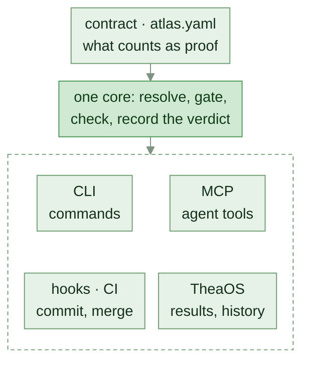

<!-- AGENTS: do not read this page breadth-first. Plug in: `python scripts/atlas.py port <file>`,
     or parse .agent/bootstrap.json — one record back. -->
<!-- mcp-name: io.github.HeartlandIntel/thea -->
<p align="center">
  
</p>

<h1 align="center"><picture>
  <source media="(prefers-color-scheme: dark)" srcset="docs/assets/title-dark.svg">
  
</picture></h1>

<p align="center">
  A machine-readable rulebook for AI coding agents, and the build checks that enforce it.<br>
  <em>AI proposes a change. The file's own toolchain proves it. The build refuses what skipped a check.</em>
</p>

<p align="center">
  <a href="https://github.com/HLIntel/thea-software/actions/workflows/atlas-ci.yml"></a>
  <a href="https://github.com/HLIntel/thea-software/releases/latest"></a>
  <a href="https://scorecard.dev/viewer/?uri=github.com/HLIntel/thea-software"></a>
</p>

Agents start at [llms.txt](llms.txt); chats at [CHAT.md](CHAT.md).

## What it does

Thea tells an AI coding agent which commands prove a change to a file, and fails the build when a
change skipped them. One declaration, [`atlas.yaml`](atlas.yaml), answers **what proves this change
is correct?**

<!-- BEGIN generated: proof-flow (python scripts/atlas.py index --write) -->

<!-- END generated: proof-flow -->

<!-- BEGIN generated: gate-example (python scripts/atlas.py index --write) -->
```console
$ thea gate scripts/doctor.py
1. formatter: ruff format --check scripts/doctor.py
2. compiler_or_typechecker: python3 -c 'import ast,sys; [ast.parse(open(f, encoding="utf-8").read(), f) for f in sys.argv[1:]]' scripts/doctor.py
3. unit_tests: pytest
```
<!-- END generated: gate-example -->

**Not** an app framework or a runtime optimizer.

## Quickstart

<!-- BEGIN generated: install (python scripts/atlas.py index --write) -->
```bash
# no checkout
uv tool install thea-software && thea doctor
# or, editable
git clone --depth 1 --branch v3.54.0 https://github.com/HLIntel/thea-software ~/thea && uv tool install --editable ~/thea && thea doctor
```
<!-- END generated: install -->

```bash
cd ~/thea
thea port scripts/doctor.py   # route, gates, lessons
thea gate scripts/doctor.py   # what proves a change
thea verify                   # exit 0 only if all PASS
```

Read-only MCP: `thea-mcp`. Other repos: [CONSUMING](docs/CONSUMING.md).

<!-- BEGIN generated: port-example (python scripts/atlas.py index --write) -->
```console
$ thea port scripts/doctor.py --line
◉ scripts/doctor.py │ ⠟backend │ python │ ⌂scripts │ ✓3 │ ⚠1 │ → thea gate scripts/doctor.py
$ thea port scripts --line
◎ scripts │ ⠟102 │ ⌂scripts │ → thea brainstorm
$ thea port . --line
○ . │ ⠟129 ⠿4 ⠁3 │ → thea check
```
<!-- END generated: port-example -->

## Measured, not claimed

Every figure below is generated on each build; `check` fails when one drifts, and sites read the
same keys from [.agent/facts.json](.agent/facts.json). They prove routing and refusals, not
end-to-end task success ([limits](docs/CERTIFICATION.md#what-the-numbers-do-not-prove)).

<!-- BEGIN generated: measured-benefits (python scripts/atlas.py index --write) -->
*With Thea* the model sees what `thea gate` prints; *blind* it sees only the language names.

**Right answers, with Thea vs blind** (`abtest.py` v3.49.0, 76 questions per Claude model)
- **Opus:** 100% vs 41%; 90% fewer tokens.
- **Sonnet:** 100% vs 39%; 90% fewer tokens.
- **Haiku:** 100% vs 39%; 91% fewer tokens.
- **Claude Code start-up:** 1,053 tokens (`CLAUDE.md` and its imports).
- **All 11 models** (5 providers, 2,409 questions, v2.27.0 / v2.28.0 / v3.49.0): 99% vs 59% (95% intervals 98–99, 55–63); weakest 97%; a random guess 2.8%.

**Beyond routing** (blind → with Thea, `taskbench.py` v2.29.0)
- **Name a failure from its symptom:** Opus 93% → 100% · Sonnet 57% → 100% · Haiku 64% → 96%
- **List the checks a change needs:** Opus 12% → 100% · Sonnet 12% → 100% · Haiku 0% → 100%
- **Spot a line the build refuses (coin flip: 50%):** Opus 60% → 100% · Sonnet 60% → 100% · Haiku 40% → 100%
- **Hand off with the right checks** (schema only → with Thea, `workflowbench.py`): Opus 0/6 → 6/6 · Sonnet 0/6 → 6/6 · Haiku 0/6 → 6/6
- *Not measured:* visual design, open-ended strategy, arithmetic — nothing declares a right answer.

**Failures caught**
- **17/17** planted breaks refused at commit, in 12 of 42 languages; 11 have an example not yet trialled, 19 none (`enforce.py` v3.53.0).
- **503** mistake kinds planted in the tests, each refused.
- **114** failure shapes recorded from real runs: 202 sightings, 46 recurred, 95 now guarded.
- **245** refusals in daily use (26 shapes, 166 re-fired); verify 21 pass / 40 fail; 46/48 lands armed; 139 lessons shown (`agents.py --field` v3.54.0).
- **24/24** solo commits clean with or without the hook; a planted broken commit is refused.
- **6** agent controls block, never warn: narrow_tools, sandbox, budget, approval, effects, audit.

**Cost**
- **1,734** tokens read before routing; 205 more documents (628 KiB) load only when a route names one.
- **89%** fewer tokens than pasting every tool list; 51% fewer than blind.
- **10 KiB** install: 1 module, 1 dependency.

**Coverage**
- **378** language × check pairs (42 × 9), all answered: 143 by a command, 235 by a declared *no tool*, 0 silent.
<!-- END generated: measured-benefits -->
<!-- BEGIN generated: repository-facts (python scripts/atlas.py index --write) -->
- **401** tool entries — across 42 manifests and 5 kinds, validated against `tools/tools.schema.json`
- **331** agreement edges — each a file tied to the declaration it answers for
- **80** instruments — each stating what it proves, what it does not, and what closes the gap
- **8** change classes — and 14 task profiles, in `atlas.yaml`
- **102** harness Python files — every one held by `lint` · `format` · `typecheck`
- **3.54.0** contract version — `VERSION`, asserted in 7 other files
<!-- END generated: repository-facts -->

## For agents

- **Plug in** with `thea port <file>`, or parse [.agent/bootstrap.json](.agent/bootstrap.json); load only what it names.
- **Read machine output, not this page.** Add `--json` to any command: one record per gate, frozen in
  [tools/atlas-output.schema.json](tools/atlas-output.schema.json).
- **Before a shell command,** `thea shell --json "<cmd>"`: exit 3 means its verdict would be misread.
- **Land** with `python scripts/branchstate.py --land`; ask `thea landed <branch>` before deleting one.
- **Judgments** answer on [rules, teacher or a keyless student](systems/AGENT-HARNESS.md#judgment-rungs).
- **When something breaks,** file it the same turn with the [`thea` skill](skills/thea/SKILL.md).


## Find your way

- **Every document:** [docs index](docs/INDEX.md) · [wiki](wiki/README.md)
- **Languages:** [atlas](languages/ATLAS.md) · [routing](wiki/CODE-ROUTING.md) · [verification](docs/VERIFY.md)
- **Agents:** [harness](systems/AGENT-HARNESS.md) · [`.thea`](docs/THEA-LANGUAGE.md) · [runtimes](models/README.md)
- **Why a rule exists:** `thea why` · `thea failures` · [instruments](docs/INSTRUMENTS.md)
- **Security:** [policy](SECURITY.md) · [OpenSSF](docs/OPENSSF.md)

## Project

The version tracks the **contract**, not the content: [docs/VERSIONING.md](docs/VERSIONING.md).
Built by **HLIntel LLC**, public on purpose: **no secret, private path or internal host enters
it** ([ABOUT.md](ABOUT.md)). Contributions pass `thea verify`. [MIT License](LICENSE).
