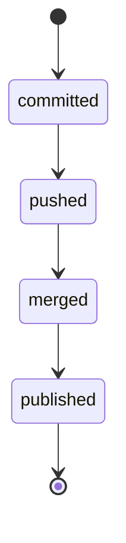

# Branches and Worktrees

GitHub branches isolate development work, while worktrees let multiple branches be checked out simultaneously. See the [GitHub branches documentation](https://docs.github.com/en/pull-requests/reference/branches).

## Recommended structure

```text
main
 |
 +-- feat/<topic>
 +-- fix/<topic>
 +-- research/<topic>
 +-- security/<topic>
 +-- lang/<language>/<topic>
```

Every active branch should have one clear purpose.

### Language branches

Do **not** create permanent branches such as:

```text
python
rust
go
typescript
cpp
```

Use temporary language lanes instead:

```text
lang/python/agent-harness
lang/rust/boundary-tests
lang/go/worker-pool
lang/typescript/vscode-router
```

This gives an agent language-local context without turning the repository into many incompatible versions.

## Worktree rule

Use one mutable writer per worktree.

```text
main checkout              -> stable inspection
worktree A                 -> lang/python/agent-harness
worktree B                 -> lang/rust/boundary-tests
worktree C                 -> feat/mcp-routing
```

A worktree isolates the checkout and mutable working tree, but not external dependency caches, credentials, running services, or build outputs outside the worktree. Those boundaries must still be explicit.

## Choose the branch by change scope

| Change | Branch |
|---|---|
| one language guide/tooling | `lang/<language>/<topic>` |
| one feature across shared code | `feat/<topic>` |
| defect | `fix/<topic>` |
| experiment/evaluation | `research/<topic>` |
| security | `security/<topic>` |
| MODEL/atlas/CI/version contract | `feat/<topic>` or `fix/<topic>` |
| multiple language boundary | repository-wide topic branch |

## Agent handoff

Every worktree/branch should carry:
- task objective
- allowed paths
- forbidden paths
- native commands
- verification checks
- expected artifact/diff
- budget/deadline
- rollback or snapshot point for high-impact work

See [systems/AGENT-HARNESS.md](../systems/AGENT-HARNESS.md).

## Merge rule

All meaningful language lanes merge back through the canonical `main` contract. A language lane must not redefine repository-wide model, routing, MCP, CI, security, or version policy independently.

<!-- BEGIN generated: landed-states (python scripts/atlas.py index --write) -->
Derived from `atlas.yaml/branch_policy/landed_states`; `branchstate.py --land` reads each one back.


<!-- END generated: landed-states -->

## Worktree lifecycle — the rules that keep a tree from accreting

Measured at contract v1.0.0 on a consuming repository: two agent worktrees sat on disk at
**507 MB** with `ahead=0` — every commit already in `main`, nothing to lose, and *(measured at v1.1.0)*
neither removed. A worktree costs a full checkout of the tree; an agent-created one
costs it silently.

### The main worktree

**One checkout is the main worktree and it is never a branch lane.** It sits at the
repository's own path, tracks the default branch, and is the only tree a human edits
by habit. Everything else is temporary by construction. `git worktree list` prints
the main one first; if the first row is not the path you think of as the repository,
the tree has already drifted.

### Merge rules

1. **A lane merges into `main`, never into another lane.** Two lanes sharing a base
   diverge twice and reconcile once, badly.
2. **Rebase the lane onto `main`, then fast-forward `main`.** No merge commit for a
   lane that is one topic; the history stays linear and `required_linear_history`
   on the default branch enforces it.
3. **A lane that is `behind` and not `ahead` is finished.** `git rev-list --count
   main..<branch>` is the test, not the branch's age and not whether anyone
   remembers it. Zero means every commit is already in `main`.
4. **Never force-push a lane someone else may have checked out**, and never force
   anything at a backup remote.
5. **Conflicts are resolved in the lane**, then the lane is re-tested, then merged.
   A conflict resolved during the merge is a conflict nobody reviewed.

### Worktree rules

6. **Create a worktree for work that must not disturb the main checkout** — a long
   agent run, a second language toolchain, a bisect. Not for an edit you could make
   and commit in five minutes.
7. **One mutable writer per worktree.** Two processes writing one tree is the
   fastest way to a half-applied change nobody can attribute.
8. **Remove the worktree in the same session that merges the lane.** `git worktree
   remove <path> && git branch -d <branch>` — `-d` refuses unless the branch is
   merged, which is the guard: if it refuses, the work is not finished.
9. **`git worktree prune` after any manual directory removal**, or the registry
   keeps pointing at a path that no longer exists.
10. **Sweep the roster, and print the count.** A worktree that is `ahead=0`,
    untouched, and still on disk is the same shape as a stale branch with a
    checkout attached:

```bash
git worktree list | tail -n +2 | while read -r path _ br; do
  b=${br#[}; b=${b%]}
  printf '%s ahead=%s size=%s\n' "$b" "$(git rev-list --count main.."$b" 2>/dev/null)" "$(du -sh "$path" | cut -f1)"
done
```

11. **A generated directory inside a worktree is counted twice on disk.**
    `node_modules`, a database, a build output: of the 507 MB above, 500 MB was *(measured at v1.1.0)*
    of one gitignored store. Remove the worktree rather than the store.

## How much unpushed work is too much

**Bounded by what grows, not by how many branches hold it.** The question that produced this rule
was "cap at four branches, or five, or six?" — and when it was measured, this tree had three
branches and two worktrees, so every one of those caps was already satisfied and none of them
would ever have fired. Meanwhile eight commits sat unpushed on one branch for about three hours.

A container count is not the quantity. What is lost when a worktree is destroyed is **commits and
time**, so `atlas.yaml/branch_policy/unpushed_bound` caps those, and `scripts/branchstate.py`
reports them per branch with the exit code as the verdict.

The numbers come from that session rather than from taste: eight commits means a cap of five
fires **once**, in the middle, while acting on it is still cheap — a cap of three would have fired
three times in the same session, and a guard that fires three times an hour is a guard that gets
silenced.

**It never pushes.** Pushing is an outward-facing act on a repository, not a tidy-up, and an
instrument that did it unasked is the unattended side effect the agent controls exist to refuse.
